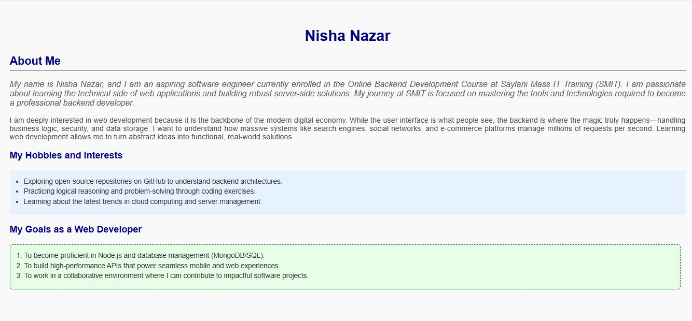
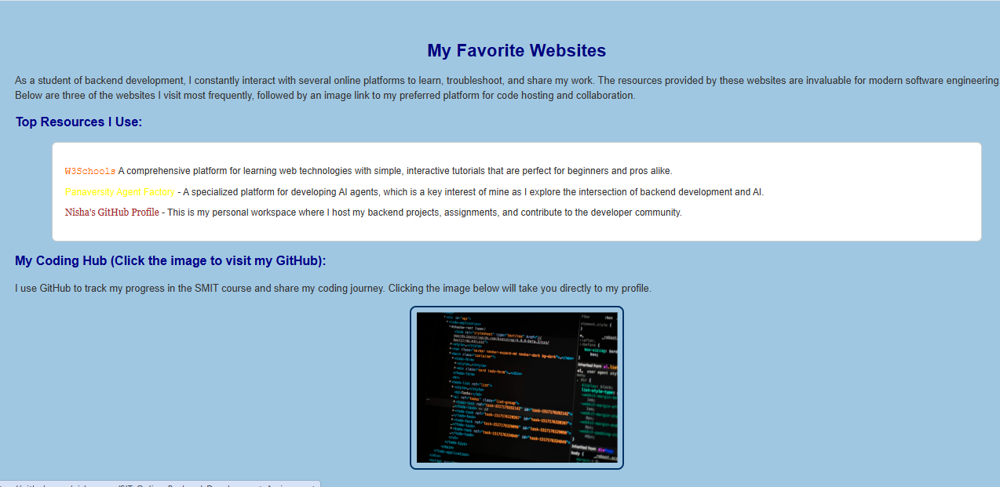
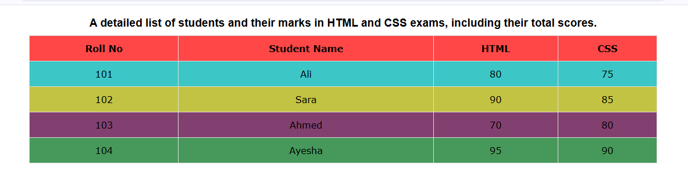
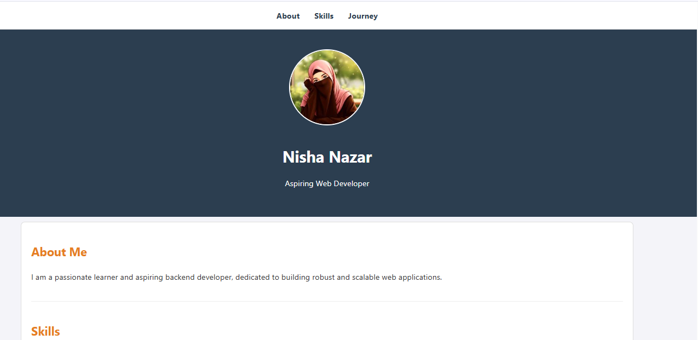
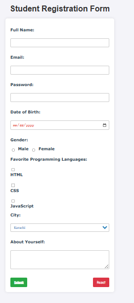
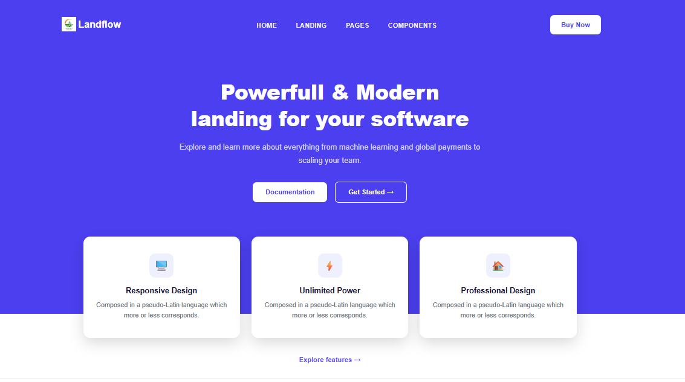

# HTML & CSS Basics Assignment 02

This directory contains the completed assignments for the second part of the HTML & CSS Basics module, focusing on styling with CSS.

## Assignment Overview
This assignment demonstrates the application of CSS to structure and style web pages, including the use of layout techniques like Flexbox.

### Completed Tasks
1. **[Introduction](introduction.html)**: Personal introductory page styled with CSS.
   
2. **[Favorite Websites](websites.html)**: A webpage featuring external links and image integration with CSS layout.
   
3. **[Student Marks Table](marks.html)**: Structured data representation using HTML table elements with CSS styling.
   
4. **[User Profile](profile.html)**: A profile page layout built with CSS.
   
5. **[Student Registration Form](registration.html)**: An interactive form collecting user input, styled with CSS.
   
6. **[Flexbox Layout](flexbox.html)**: Demonstration of Flexbox layout techniques.
   

## Technical Notes
- **Structure:** All files follow valid HTML5 standards.
- **Styling:** CSS is utilized for layout and design in separate files (`.css`).
