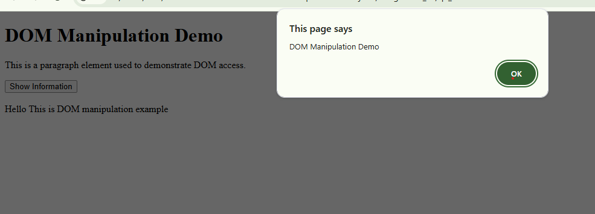

# Assignment 03 - HTML, CSS & JavaScript Basics

This repository contains the completed solutions for Assignment 03.

## Question 1: Responsive Layout Using CSS Grid
Design a responsive webpage layout for "TechNova" using HTML and CSS Grid.

### Screenshot (Reference)

### Files
- [q1_index.html](q1_index.html)
- [q1_style.css](q1_style.css)

---

## Question 2: DOM Manipulation with JavaScript
Demonstrate basic DOM manipulation using `document.write()` and `getElementById()`, along with `alert()` and `console.log()`.

### Screenshot

### Files
- [q2_dom.html](q2_dom.html)
- [q2_script.js](q2_script.js)

---

## Question 3: JavaScript Variables & Data Types
Demonstrate the use of `var`, `let`, `const`, and various JavaScript data types.

### Screenshot
.png)

### Files
- [q3_variables.html](q3_variables.html)
- [q3_variables.js](q3_variables.js)

---
*Happy Coding!*
